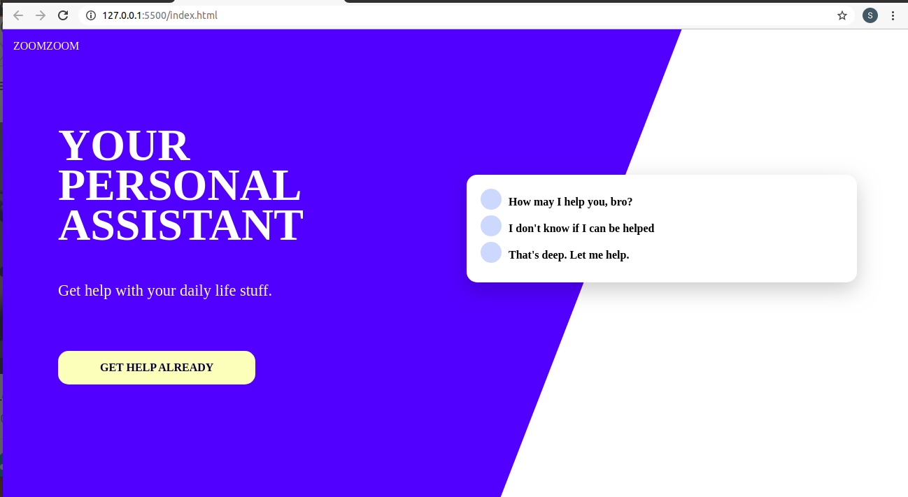

Made this by following along the crash course by Design Course.

Through this course I learned:
1. About SASS
2. How to setup SASS 
3. Creating and using variables
4. SASS maps
5. Creating and using functions
6. Nesting 
7. Making a page responsive using mixnine

Desktop view

iPhone X view

